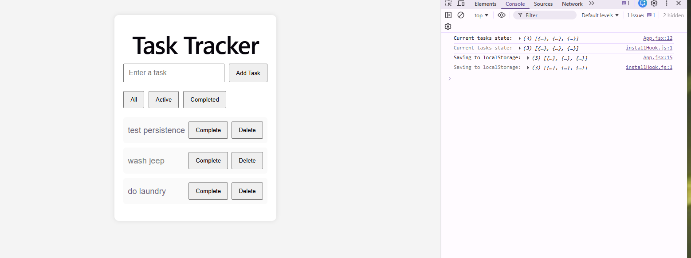

# React Task Tracker

## Project Overview

This project is a simple task tracker built with React. It allows users to add, complete, delete, and filter tasks. Tasks persist using browser localStorage.

This project demonstrates core front-end engineering skills including:

• React state management  
• Component rendering  
• Event handling  
• Immutable updates  
• Local storage persistence  
• UI filtering logic  

---

## Features

• Add tasks  
• Delete tasks  
• Mark tasks complete  
• Filter All / Active / Completed  
• Data persistence using localStorage  
• Clean responsive layout  

---

## Technologies Used

React  
JavaScript  
Vite  
CSS  
localStorage API  

---

## Architecture Decisions

### Why React
React allows component-based UI development and clear state management.

### Why useState
Used to manage:
- task input
- task list
- filter state

### Why useEffect
Used to:
- synchronize tasks with localStorage
- persist user data

### Why task objects instead of strings

Tasks are structured like:

npm install
Start development server:

npm run dev

Open:
http://localhost:5173

---

## Future Improvements

Potential enhancements:

• Edit task feature  
• Task priorities  
• Due dates  
• Dark mode  
• Drag and drop ordering  
• Backend API integration  

---

## Application Screenshot

## Author

Colleen Cummings

Senior Technical Consultant | Cloud Engineer | Software Engineer

GitHub:
https://github.com/Geeklady55
